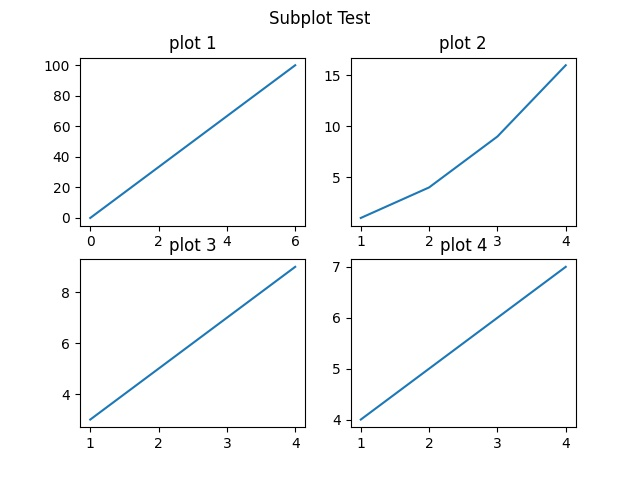

&emsp;
# Matplotlib 绘制多图
我们可以使用 pyplot 中的 subplot() 方法来绘制多个子图。

subpot() 方法在绘图时需要指定位置

&emsp;
# 1 subplot
>语法
```python
subplot(nrows, ncols, index, **kwargs)
```
- 将整个绘图区域分成 nrows 行和 ncols 列，然后从左到右，从上到下的顺序对每个子区域进行编号 1...N ，左上的子区域的编号为 1、右下的区域编号为 N，编号可以通过参数 index 来设置。


>示例 1
```python
import matplotlib.pyplot as plt
import numpy as np

#plot 1:
xpoints = np.array([0, 6])
ypoints = np.array([0, 100])

plt.subplot(1, 2, 1) # 1 x 2 中的第 1 张图
plt.plot(xpoints,ypoints)
plt.title("plot 1")

#plot 2:
x = np.array([1, 2, 3, 4])
y = np.array([1, 4, 9, 16])

plt.subplot(1, 2, 2) # 1 x 2 中的第 2 张图
plt.plot(x,y)
plt.title("plot 2")

plt.suptitle("Subplot Test")
plt.savefig("./imgs/test17.jpg")
```
显示结果如下：


>示例 2
```python
import matplotlib.pyplot as plt
import numpy as np

#plot 1:
x = np.array([0, 6])
y = np.array([0, 100])

plt.subplot(2, 2, 1) # 2x2 中的第 1 张
plt.plot(x,y)
plt.title("plot 1")

#plot 2:
x = np.array([1, 2, 3, 4])
y = np.array([1, 4, 9, 16])

plt.subplot(2, 2, 2) # 2x2 中的第 2 张
plt.plot(x,y)
plt.title("plot 2")

#plot 3:
x = np.array([1, 2, 3, 4])
y = np.array([3, 5, 7, 9])

plt.subplot(2, 2, 3) # 2x2 中的第 3 张
plt.plot(x,y)
plt.title("plot 3")

#plot 4:
x = np.array([1, 2, 3, 4])
y = np.array([4, 5, 6, 7])

plt.subplot(2, 2, 4) # 2x2 中的第 4 张
plt.plot(x,y)
plt.title("plot 4")

plt.suptitle("Subplot Test")
plt.savefig("./imgs/test18.jpg")
```
显示结果如下：

