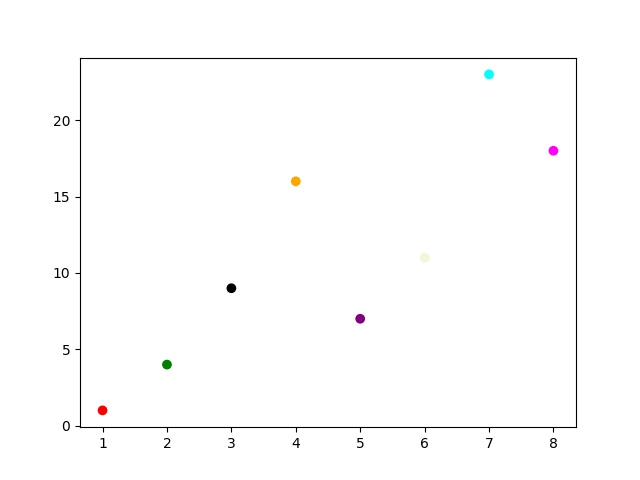
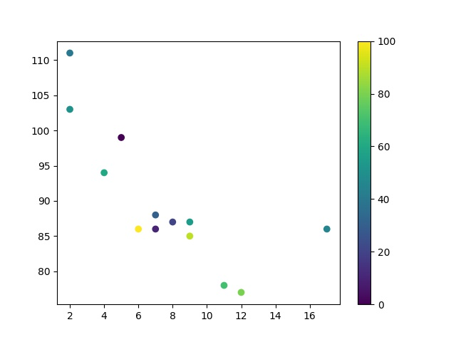

&
# Matplotlib 散点图

&emsp;
# 1 基础使用
我们可以使用 pyplot 中的 scatter() 方法来绘制散点图。

>语法
```python
matplotlib.pyplot.scatter(x, y, s=None, c=None, marker=None, cmap=None, norm=None, vmin=None, vmax=None, alpha=None, linewidths=None, *, edgecolors=None, plotnonfinite=False, data=None, **kwargs)
```
>参数

- x，y：长度相同的数组，也就是我们即将绘制散点图的数据点，输入数据。
- s：点的大小，默认 20，也可以是个数组，数组每个参数为对应点的大小。
- c：点的颜色，默认蓝色 'b'，也可以是个 RGB 或 RGBA 二维行数组。
- marker：点的样式，默认小圆圈 'o'。
- cmap：Colormap，默认 None，标量或者是一个 colormap 的名字，只有 c 是一个浮点数数组的时才使用。如果没有申明就是 image.cmap。
- norm：Normalize，默认 None，数据亮度在 0-1 之间，只有 c 是一个浮点数的数组的时才使用。
- vmin，vmax：：亮度设置，在 norm 参数存在时会忽略。
- alpha：：透明度设置，0-1 之间，默认 None，即不透明。
- linewidths：：标记点的长度。
- edgecolors：：颜色或颜色序列，默认为 'face'，可选值有 'face', 'none', None。
- plotnonfinite：：布尔值，设置是否使用非限定的 c ( inf, -inf 或 nan) 绘制点。
- **kwargs：：其他参数。

>示例 1

```python
import matplotlib.pyplot as plt
import numpy as np

x = np.array([1, 2, 3, 4, 5, 6, 7, 8])
y = np.array([1, 4, 9, 16, 7, 11, 23, 18])

plt.scatter(x, y)
plt.savefig("./imgs/test20.jpg")
```
显示结果如下：


>示例 2：设置图标大小：

```python
import matplotlib.pyplot as plt
import numpy as np

x = np.array([1, 2, 3, 4, 5, 6, 7, 8])
y = np.array([1, 4, 9, 16, 7, 11, 23, 18])
sizes = np.array([20,50,100,200,500,1000,60,90])
plt.scatter(x, y, s=sizes)
plt.savefig("./imgs/test21.jpg")
```
显示结果如下：


&emsp;
# 2 自定义点的颜色
```python
import matplotlib.pyplot as plt
import numpy as np

x = np.array([1, 2, 3, 4, 5, 6, 7, 8])
y = np.array([1, 4, 9, 16, 7, 11, 23, 18])
colors = np.array(["red","green","black","orange","purple","beige","cyan","magenta"])

plt.scatter(x, y, c=colors)
plt.savefig("./imgs/test22.jpg")
```
显示结果如下：



&emsp;
# 3 设置两组散点图：
```python
import matplotlib.pyplot as plt
import numpy as np

x = np.array([5,7,8,7,2,17,2,9,4,11,12,9,6])
y = np.array([99,86,87,88,111,86,103,87,94,78,77,85,86])
plt.scatter(x, y, color = 'hotpink')

x = np.array([2,2,8,1,15,8,12,9,7,3,11,4,7,14,12])
y = np.array([100,105,84,105,90,99,90,95,94,100,79,112,91,80,85])
plt.scatter(x, y, color = '#88c999')

plt.savefig("./imgs/test23.jpg")
```
显示结果如下：


&emsp;
# 4 使用随机数来设置散点图：
```python
import numpy as np
import matplotlib.pyplot as plt
# 随机数生成器的种子
np.random.seed(19680801)

N = 50
x = np.random.rand(N)
y = np.random.rand(N)
colors = np.random.rand(N)
area = (30 * np.random.rand(N))**2  # 0 to 15 point radii

plt.scatter(x, y, s=area, c=colors, alpha=0.5) # 设置颜色及透明度
plt.title("Scatter Test") # 设置标题
plt.savefig("./imgs/test24.jpg")
```
显示结果如下：


&emsp;
# 5 颜色条 Colormap
- Matplotlib 模块提供了很多可用的颜色条。

- 颜色条就像一个颜色列表，其中每种颜色都有一个范围从 0 到 100 的值。

- 设置颜色条需要使用 cmap 参数，默认值为 'viridis'，之后颜色值设置为 0 到 100 的数组。

>示例 1
```python
import matplotlib.pyplot as plt
import numpy as np

x = np.array([5,7,8,7,2,17,2,9,4,11,12,9,6])
y = np.array([99,86,87,88,111,86,103,87,94,78,77,85,86])
colors = np.array([0, 10, 20, 30, 40, 45, 50, 55, 60, 70, 80, 90, 100])

plt.scatter(x, y, c=colors, cmap='viridis')

plt.savefig("./imgs/test25.jpg")
```
显示结果如下：


>示例 2：使用 plt.colorbar() 显示颜色条
```python
import matplotlib.pyplot as plt
import numpy as np

x = np.array([5,7,8,7,2,17,2,9,4,11,12,9,6])
y = np.array([99,86,87,88,111,86,103,87,94,78,77,85,86])
colors = np.array([0, 10, 20, 30, 40, 45, 50, 55, 60, 70, 80, 90, 100])

plt.scatter(x, y, c=colors, cmap='viridis')
plt.colorbar()
plt.savefig("./imgs/test26.jpg")
```
显示结果如下：


