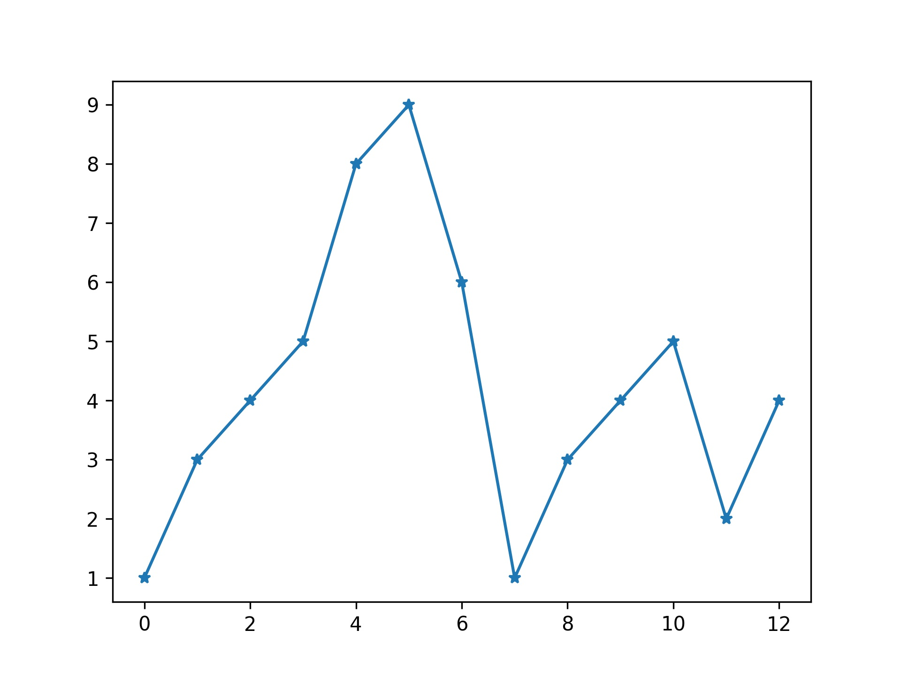

&emsp;
# Matplotlib 绘图标记
绘图过程如果我们想要给坐标自定义一些不一样的标记，就可以使用 plot() 方法的 marker 参数来定义。


&emsp;
# 1 fmt 参数
fmt 参数定义了基本格式，如标记、线条样式和颜色。
```
fmt = '[marker][line][color]'
```
例如 o:r，o 表示实心圆标记，: 表示虚线，r 表示颜色为红色。


>marker 可以定义的符号

标记	|描述
:--|:--
"."	|点
"o"	|实心圆
"v"	|下三角
"^"	|上三角
"<"	|左三角
">"	|右三角
"s"	|正方形
"P"	|加号（填充）
"+"	|加号
"x"	|乘号 x
"X"	|乘号 x (填充)


>线类型：

线类型标记	|描述
:--|:--
'-'	|实线
':'	|虚线
'--'|	破折线
'-.'|	点划线

>颜色类型：

颜色标记	|描述
:--|:--
'r'	|红色
'g'	|绿色
'b'	|蓝色
'c'	|青色
'm'	|品红
'y'	|黄色
'k'	|黑色
'w'	|白色


>示例 1
```python
import matplotlib.pyplot as plt
import numpy as np

ypoints = np.array([6, 2, 13, 10])

plt.plot(ypoints, 'o:r')
# plt.show() # 在 PyCharm、Jupyter 可以用
plt.savefig("./imgs/test10.jpg", dpi=300)
```
输出结果如下所示：


&emsp;
>示例 2:实心圆标记
```python
import matplotlib.pyplot as plt
import numpy as np

ypoints = np.array([1,3,4,5,8,9,6,1,3,4,5,2,4])

plt.plot(ypoints, marker = 'o')
# plt.show() # 在 PyCharm、Jupyter 可以用
plt.savefig("./imgs/test8.jpg", dpi=300)
```

输出结果如下所示：


&emsp;
>示例 3: * 标记
```python
import matplotlib.pyplot as plt
import numpy as np

ypoints = np.array([1,3,4,5,8,9,6,1,3,4,5,2,4])

plt.plot(ypoints, marker = '*')
# plt.show() # 在 PyCharm、Jupyter 可以用
plt.savefig("./imgs/test9.jpg", dpi=300)
```
输出结果如下所示：



