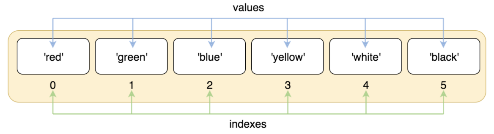

&emsp;
# List

- 序列是 Python 中最基本的数据结构。

- 序列中的每个值都有对应的位置值，称之为索引，第一个索引是 0，第二个索引是 1，依此类推。

- Python 有 6 个序列的内置类型，但最常见的是列表和元组。

- 列表都可以进行的操作包括索引，切片，加，乘，检查成员。

- 列表是最常用的 Python 数据类型，它可以作为一个方括号内的逗号分隔值出现。

- 列表的数据项不需要具有相同的类型

- 创建一个列表，只要把逗号分隔的不同的数据项使用方括号括起来即可。

>示例
```python
list1 = ['Google', 'Runoob', 1997, 2000]
list2 = [1, 2, 3, 4, 5 ]
list3 = ["a", "b", "c", "d"]
list4 = ['red', 'green', 'blue', 'yellow', 'white', 'black']
```

&emsp;
# 1 访问列表中的值
- 与字符串的索引一样，列表索引从 0 开始，第二个索引是 1，依此类推。

- 通过索引列表可以进行截取、组合等操作。




>示例
```python
list = ['red', 'green', 'blue', 'yellow', 'white', 'black']
print( list[0] )
print( list[1] )
print( list[2] )
```

- 索引也可以从尾部开始，最后一个元素的索引为 -1，往前一位为 -2，以此类推。


>示例
```python
list = ['red', 'green', 'blue', 'yellow', 'white', 'black']
print( list[-1] )
print( list[-2] )
print( list[-3] )
```

使用下标索引来访问列表中的值，同样你也可以使用方括号 [] 的形式截取字符，如下所示：


```python
nums = [10, 20, 30, 40, 50, 60, 70, 80, 90]
print(nums[0:4])

list = ['Google', 'Runoob', "Zhihu", "Taobao", "Wiki"]
# 读取第二位
print ("list[1]: ", list[1])
# 从第二位开始（包含）截取到倒数第二位（不包含）
print ("list[1:-2]: ", list[1:-2])
```


 
&emsp;
# 2 更改列表
你可以对列表的数据项进行修改或更新，你也可以使用 append() 方法来添加列表项，如下所示：

>示例
```python
list = ['Google', 'Runoob', 1997, 2000]
 
print ("第三个元素为 : ", list[2])
list[2] = 2001
print ("更新后的第三个元素为 : ", list[2])
 
list1 = ['Google', 'Runoob', 'Taobao']
list1.append('Baidu')
print ("更新后的列表 : ", list1)
```


&emsp;
# 4 Python列表脚本操作符
列表对 + 和 * 的操作符与字符串相似。+ 号用于组合列表，* 号用于重复列表。

如下所示：

Python表达式	|结果	|描述
|:--|:--|:--|
len([1, 2, 3])	|3	|长度 
[1, 2, 3] + [4, 5, 6]	|[1, 2, 3, 4, 5, 6]	|组合
['Hi!'] * 4	|['Hi!', 'Hi!', 'Hi!', 'Hi!']	|重复
3 in [1, 2, 3]	|True	|元素是否存在于列表中
for x in [1, 2, 3]: print(x, end=" ")	|1 2 3|	迭代


&emsp;
# 6 嵌套列表
使用嵌套列表即在列表里创建其它列表，例如：
```python
a = ['a', 'b', 'c']
n = [1, 2, 3]
x = [a, n]
print(x)
# 输出：[['a', 'b', 'c'], [1, 2, 3]]
print(x[0])
# 输出：['a', 'b', 'c']
print(x[0][1])
# 输出：'b'
```

&emsp;
## 1.1 列表推导式
&emsp;&emsp;列表推导式创建列表很优雅。

&emsp;&emsp;每个列表推导式都在 for 之后跟一个表达式，然后有零到多个 for 或 if 子句。返回结果是一个根据表达从其后的 for 和 if 上下文环境中生成出来的列表。如果希望表达式推导出一个元组，就必须使用括号。


&emsp;
# 7 Python列表函数&方法
>Python包含以下函数:

函数 | 描述
|:--|:--|
len(list) |列表元素个数
max(list) |返回列表元素最大值
min(list) |返回列表元素最小值
list(seq) |将元组转换为列表

>Python包含以下method:

方法|描述
|:--|:--|
list.append(obj) | 在列表末尾添加新的对象
list.count(obj) | 统计某个元素在列表中出现的次数
list.extend(seq) | 在列表末尾一次性追加另一个序列中的多个值（用新列表扩展原来的列表）
list.index(obj) | 从列表中找出某个值第一个匹配项的索引位置
list.insert(index, obj) | 将对象插入列表
list.pop([index=-1]) | 移除列表中的一个元素（默认最后一个元素），并且返回该元素的值
list.remove(obj) | 移除列表中某个值的第一个匹配项
list.reverse() | 反向列表中元素
list.sort( key=None, reverse=False) | 对原列表进行排序
list.clear() | 清空列表
list.copy() | 复制列表

>len()示例

len(list)
- list -- 要计算元素个数的列表。
```python
list1 = ['Google', 'Runoob', 'Taobao']
print (len(list1))
list2=list(range(5)) # 创建一个 0-4 的列表
print (len(list2))
```

>max()示例

max(list)
- list -- 要返回最大值的列表。
```python
list1, list2 = ['Google', 'Runoob', 'Taobao'], [456, 700, 200]

print ("list1 最大元素值 : ", max(list1))
print ("list2 最大元素值 : ", max(list2))
```


>min()示例

min(list)
- list -- 要返回最小值的列表。
```python
list1, list2 = ['Google', 'Runoob', 'Taobao'], [456, 700, 200]

print ("list1 最小元素值 : ", min(list1))
print ("list2 最小元素值 : ", min(list2))
```


>list()示例

list( seq )
- seq -- 要转换为列表的元组或字符串。
```python
aTuple = (123, 'Google', 'Runoob', 'Taobao')
list1 = list(aTuple)
print ("列表元素 : ", list1)

str="Hello World"
list2=list(str)
print ("列表元素 : ", list2)
```


>append()示例

list.append(obj)
- obj -- 添加到列表末尾的对象。
```python
list1 = ['Google', 'Runoob', 'Taobao']
list1.append('Baidu')
print ("更新后的列表 : ", list1)
```


>count()示例

list.count(obj)
- obj -- 列表中统计的对象。
```python
aList = [123, 'Google', 'Runoob', 'Taobao', 123];

print ("123 元素个数 : ", aList.count(123))
print ("Runoob 元素个数 : ", aList.count('Runoob'))
```


>extend()示例

list.extend(seq)
- seq -- 元素列表，可以是列表、元组、集合、字典，若为字典,则仅会将键(key)作为元素依次添加至原列表的末尾。
```python
list1 = ['Google', 'Runoob', 'Taobao']
list2=list(range(5)) # 创建 0-4 的列表
list1.extend(list2)  # 扩展列表
print ("扩展后的列表：", list1)

# 语言列表
language = ['French', 'English', 'German']
# 元组
language_tuple = ('Spanish', 'Portuguese')
# 集合
language_set = {'Chinese', 'Japanese'}
# 添加元组元素到列表末尾
language.extend(language_tuple)
print('新列表: ', language)
# 添加集合元素到列表末尾
language.extend(language_set)
print('新列表: ', language)
```


> index()示例
list.index(x[, start[, end]])
- x-- 查找的对象。
- start-- 可选，查找的起始位置。
- end-- 可选，查找的结束位置。
```python
list1 = ['Google', 'Runoob', 'Taobao']
print ('Runoob 索引值为', list1.index('Runoob'))
print ('Taobao 索引值为', list1.index('Taobao'))

list1 = ['Google', 'Runoob', 'Taobao', 'Facebook', 'QQ']
# 从指定位置开始搜索
print ('Runoob 索引值为', list1.index('Runoob',1))
```


>insert()示例

list.insert(index, obj)
- index -- 对象obj需要插入的索引位置。
- obj -- 要插入列表中的对象。
```python
list1 = ['Google', 'Runoob', 'Taobao']
list1.insert(1, 'Baidu')
print ('列表插入元素后为 : ', list1)
```


>pop()示例

list.pop([index=-1])
- index -- 可选参数，要移除列表元素的索引值，不能超过列表总长度，默认为 index=-1，删除最后一个列表值。
```python
list1 = ['Google', 'Runoob', 'Taobao']
list1.pop()
print ("列表现在为 : ", list1)
list1.pop(1)
print ("列表现在为 : ", list1)
```


>remove()示例

list.remove(obj)
- obj -- 列表中要移除的对象
```python
list1 = ['Google', 'Runoob', 'Taobao', 'Baidu']
list1.remove('Taobao')
print ("列表现在为 : ", list1)
list1.remove('Baidu')
print ("列表现在为 : ", list1)
```


>reverse()示例

list.reverse()
```python
list1 = ['Google', 'Runoob', 'Taobao', 'Baidu']
list1.reverse()
print ("列表反转后: ", list1)
```


>sort()示例

list.sort( key=None, reverse=False)
- key -- 主要是用来进行比较的元素，只有一个参数，具体的函数的参数就是取自于可迭代对象中，指定可迭代对象中的一个元素来进行排序。
- reverse -- 排序规则，reverse = True 降序， reverse = False 升序（默认）
```python
aList = ['Google', 'Runoob', 'Taobao', 'Facebook']
 
aList.sort()
print ( "List : ", aList)

# 列表
vowels = ['e', 'a', 'u', 'o', 'i']
# 降序
vowels.sort(reverse=True)
# 输出结果
print ( '降序输出:', vowels )
# 获取列表的第二个元素
def takeSecond(elem):
    return elem[1]
# 列表
random = [(2, 2), (3, 4), (4, 1), (1, 3)]
# 指定第二个元素排序
random.sort(key=takeSecond)
# 输出类别
print ('排序列表：', random)
```

>clear()示例


list.clear()
```python
list1 = ['Google', 'Runoob', 'Taobao', 'Baidu']
list1.clear()
print ("列表清空后 : ", list1)
```

>copy()示例

list.copy()
```python
list1 = ['Google', 'Runoob', 'Taobao', 'Baidu']
list2 = list1.copy()
print ("list2 列表: ", list2)
```